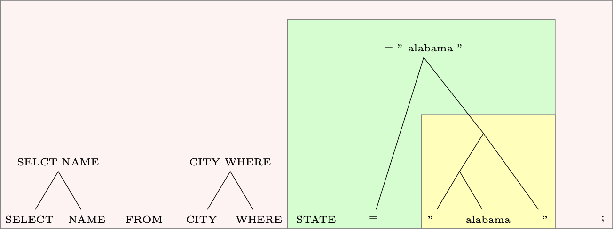

## The Code for _Byte-Pair Encoding for Text-to-SQL Generation_

This is the code we used to conduct the experiments for [this](https://arxiv.org/abs/1910.08962) paper.
It allows you to group tokens in SQL corpora, which are commonly co-located, for easier prediction. The tools even allow to restrict the grouping to neighbors in the AST. Below you can see an illustration of an encoded example sentence.

If you want to use BPE encodings for your own projects on SQL data, please check the little [doc](sqlbpe/README.md) on it.
If you are using torchtext you might also find some functions in `utils.py` helpful.
